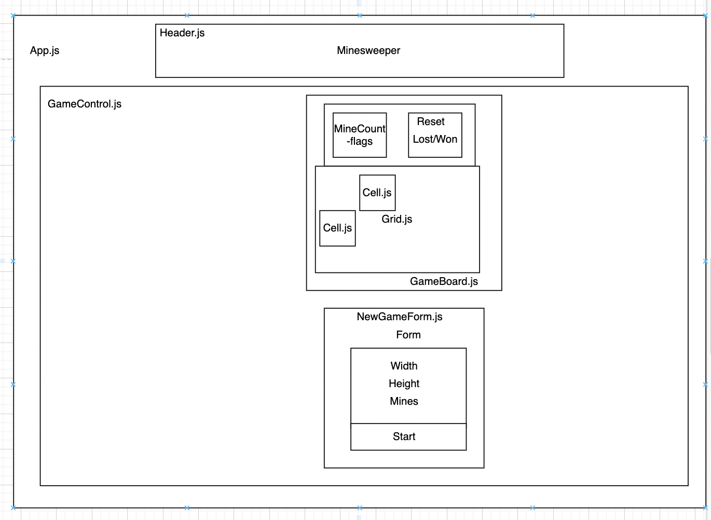

## Minesweeper

By Kim Brannian, Christopher Neal, Morgan Waites, and Hannah Young

A recreation of the classic game Minesweeper using the React and Redux libraries.

### Technologies Used

- JavaScript
- React
- Redux

### Setup

#### Requirements

* [git](https://git-scm.com)
* [Node](https://nodejs.org/en/download/)
* A modern browser, such as [Firefox](https://www.mozilla.org/en-US/firefox/new/)

#### To Start Development Web Application

1. Use terminal to navigate to desired parent directory and use `git clone https://github.com/mellowmorgan/minesweeper-react-redux.git`
2. Navigate into project directory: `cd minesweeper-react-redux`
3. Install Node.js modules: `npm install`
4. Run start script: `npm start run`
5. Use your browser to navigate to `http://localhost:3000`

### Known bugs:

* None

### React Component Diagram

### License

[Hippocratic License 3.0](https://github.com/mellowmorgan/minesweeper-react-redux/blob/main/LICENSE.md), Copyright 2022 Kim Brannian, Christopher Neal, Morgan Waites, and Hannah Young.
